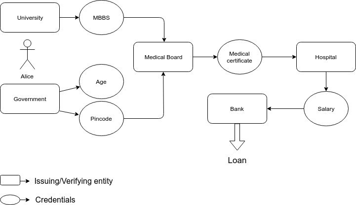

# zkCreds

## Credential verification with no data leakage

### Technologies we used
Truffle, Solidity, Javascript, Ganache, ZKPs, Aztec Protocol

### The Problem it solves
In the current systems if we want to prove some data or presense of data then we are almost always required to submit excess data. Like if you are going to watch a R Rated movie then the only thing you should show is that your age is greater than 18. But there is no way to do that without showing extra information like your exact date of birth, name, college name(in case of student ID), phone number etc. If you want to buy a sim card then the only thing which is necessary to prove is that you are an indian national and your nationality is verified by government but instead almost everyone is required to show their aadhar card which contains all your digital data like address, phone number, date of birth etc.

### What can people use it for?
These past couple of years we have seen how data can be misused so we should always try to minimize the leakage.

zkCreds is an credential verification implementation using aztec protocol. Aztec Protocol enables us to prove certain information to anyone without revealing the exact information and also without leaking any data. We are using zero knowledge range proofs to prove some information like you are above 18 yrs old without revealing your exact date of birth.  
Using such credential verification anyone can:
* Prove that they are eligible to vote or are underage or are of legal age to drink.
* Prove that their location is verified. They can prove that they live in india or karnataka or any other state without revealing complete address.
* Prove that their annual salary is between a certain range without disclosing it. This can help them in getting bank loans without disclosing full information.
* Proving hold of an information without revealing that information like proving that you have a driving license and know how to drive a car without showing the license number.
* Proving that you have a certain level of education (high school, bachelors) or proving that you have done masters without telling them anymore about that.

Using zkp for verifying credentials is faster and has less chances of users cheating the system (no chance of fake ids or fake credentials). As low level institutions usually don't have money and time to verify your fake data so it will be easier for them to just trust zk notes.

Only one time in person verification of all your creds and then for the rest of your life you'll show your digitized assets
for proving things without having another in person verification.

### Challenges we ran into
* Aztec doesn't have support yet for `PublicRangeProofs` which allows you to check if a note value lies between 2 integers. Instead we had to work with the existing `PrivateRangeProofs` where we can check if a given note has value greater than another comparison note. Had to devise a hack to use this model to get the `PublicRangeProof` functionality.
* Found a bug or two in `aztec.js` library which caused us major headache for a while.
* We encountered huge challenge when using `truffle'test suite`. It made some assumptions and didn't specify what they were and due to which we had to check our smart contracts, test logic again and again. The problem was instead in truffle's architecture (assuming that contract instance is maintained in one test, it wasn't and there was almost no logs showing why our tests were failing)

### Credentials
- Govt Issued Age
- Govt Issued Pincode
- Hospital issued AnnualSalary
- University issued HighestEducation
- BinaryAssets (Verified Phone No or not, Driving License or not)

## General Flow

  

Alice wants to get a loan from bank. First she gets her age and location verified by govt and gets a note for it. Then she asks her university for 
a degree token proving her highest education. After that the medical license record will verify her location (she should be from India to get
license in india), age (should be minimum 25 yrs old), her level of education. Because of having notes of all these creds she won't have
to go and verify these things manually or show them any extra information. After that the hospital where she wants a job
will ask her for medical license so she will just request the note from the license record and get it. Then after verifying,
hospital will pay her an annual salary and give a note of that which she will use to show it to bank that she earns above a 
threshold and will be able to get a loan.

We are using `private range proofs` where we need to prove that a number is bigger than a certain another number. We are also using it at places to prove binary information like whether she has a license or not. Ex: Possession of medical license means having a `Note 1` from license board.

We are using `divident proofs` to prove that 5% of alice's salary is greater than the threshold amount which bank requires to get a loan.

### Getting started and Running demo

1. Clone this repository `git clone git@github.com:pawanjay176/AztecDemo.git`

2. Install the dependencies `cd AztecDemo && yarn install`

3. Start up Ganache `yarn start` (This will create 5 test ethereum accounts from the credentials in `.env`)

4. Compile the contracts `truffle compile --all`

5. Deploy AZTEC! `yarn migrate`

6. Run the complete general flow. `truffle test test/flow.js`

## License

MIT
